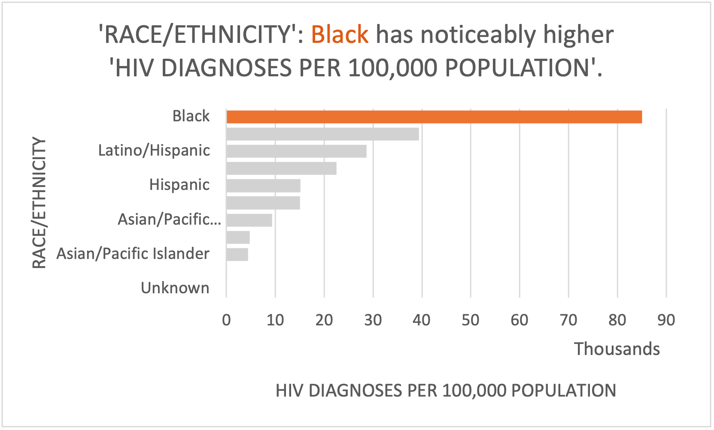
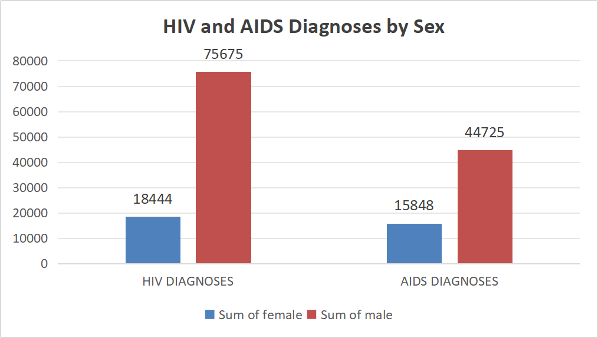
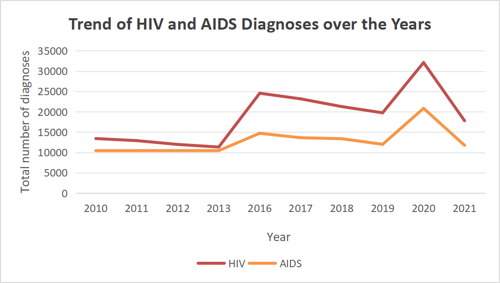

# Spreadsheet Analysis
## HIV_AIDS_Diagnoses_Analysis

### Data Set Details
1. Original Data: _HIV/AIDS Diagnoses by Neighborhood, Sex, and Race/Ethnicity_
   - This dataset includes data on new diagnoses of HIV and AIDS in NYC for the calendar years 2016 through 2020. Reported cases and case rates (per 100,000 population) are stratified by United Hospital Fund (UHF) neighborhood, sex, and race/ethnicity.
     - Link to the URL: (https://data.cityofnewyork.us/Health/HIV-AIDS-Diagnoses-by-Neighborhood-Sex-and-Race-Et/ykvb-493p/about_data)
       - Format:CSV
2. ** This is a table of RAW DATA **

| YEAR | Borough | Neighborhood (U.H.F)         | SEX    | RACE/ETHNICITY | TOTAL NUMBER OF HIV DIAGNOSES | HIV DIAGNOSES PER 100,000 POPULATION | TOTAL NUMBER OF AIDS DIAGNOSES | AIDS DIAGNOSES PER 100,000 POPULATION |
|------|---------|------------------------------|--------|----------------|-------------------------------|--------------------------------------|---------------------------------|---------------------------------------|
| 2010 | NaN     | Greenpoint                   | Male   | Black          | 6                             | 62.1                                 | 5                               | 275.3                                 |
| 2011 | NaN     | Stapleton - St. George       | Female | Native American| 0                             | 0                                    | 0                               | 0                                     |
| 2010 | NaN     | Southeast Queens             | Male   | All            | 23                            | 24.2                                 | 14                              | 15.4                                  |
| 2012 | NaN     | Upper Westside               | Female | Unknown        | 0                             | 0                                    | 0                               | 0                                     |
| 2013 | NaN     | Willowbrook                  | Male   | Unknown        | 0                             | 0                                    | 0                               | 0                                     |
| 2013 | NaN     | East Flatbush - Flatbush     | Male   | Black          | 54                            | 56.5                                 | 33                              | 34.5                                  |
| 2013 | NaN     | East Flatbush - Flatbush     | Female | Native American| 0                             | 0                                    | 0                               | 0                                     |
| 2013 | NaN     | Southwest Queens             | Female | Unknown        | 0                             | 0                                    | 0                               | 0                                     |
| 2012 | NaN     | Fordham - Bronx Park         | Male   | Unknown        | 0                             | 0                                    | 0                               | 0                                     |
| 2010 | NaN     | Flushing - Clearview         | All    | All            | 14                            | 4.3                                  | 12                              | 4.6                                   |
| 2012 | NaN     | Greenpoint                   | Female | Multiracial    | 0                             | 0                                    | 0                               | 0                                     |
| 2012 | NaN     | Chelsea - Clinton            | Female | Native American| 0                             | 0                                    | *                               | *                                     |
| 2012 | NaN     | Coney Island - Sheepshead Bay| Male   | Black          | 20                            | 23.1                                 | 0                               | 0                                     |
| 2010 | NaN     | Southwest Queens             | Female | Black          | 11                            | 12.1                                 | 0                               | 0                                     |
| 2013 | NaN     | Unknown                      | Male   | Unknown        | 0                             | NaN                                  | 1                               | NaN                                   |
| 2013 | NaN     | Willowbrook                  | Male   | Black          | 0                             | 0                                    | 0                               | 0                                     |
| 2012 | NaN     | Flushing - Clearview         | Male   | Black          | 56                            | 71.4                                 | 5                               | 7.9                                   |
| 2013 | NaN     | Gramercy Park - Murray Hill  | Male   | White          | 5                             | 20                                   | 5                               | 200.7                                 |
| 2012 | NaN     | Crotona - Tremont            | Female | Black          | 0                             | 0                                    | 0                               | 0                                     |
| 2012 | NaN     | Willowbrook                  | Female | Black          | 0                             | 0                                    | 0                               | 0                                     |
| 2013 | NaN     | Jamaica                      | Female | Black          | 0                             | 0                                    | 0                               | 0                                     |

3. ** Describe the problems that were present in the data and the scrubbing tasks **
    - Data munging is a critical step in the data analysis process. It involves cleaning and transforming raw data into a format that is more suitable for analysis. We use Python code to clean a dataset without relying on specialized data munging or analysis modules such as pandas or csv. The goal is to ensure that the cleanup and transformation are repeatable, making the cleaned data ready for analysis.
  - The raw dataset contains several issues that hinder direct analysis:  
  1. **Presence of Notes**: The file includes non-data lines at the top and bottom, containing notes that must be removed.
  2. **Repeated Column Headings**: Column headings are duplicated across the file. Only the first occurrence should be retained.
  3. **Blank Lines**: Some lines in the dataset are blank and need to be removed to maintain data integrity.
  4. **Data**: Missing data is indicated by "*" or "NA" and requires appropriate handling to ensure accurate analyses.
  - Now we will display the python code of each step.
  1. Removing Notes and Blank Lines
     ```python
     # Skip note lines and blank lines
     if line.startswith('#') or line.strip() == '':
     continue  
  2. Handling Repeated Column Headings
     ```python
     # Check for column headers and write them only once
     if 'Column1' in cleaned_line:
          if not headers_written:
             column_headers = cleaned_line
             headers_written = True
             cleaned_lines.append(column_headers + '\n')  
  3. Replacing Missing Data Indicators
     ```python
     # Replace missing data indicators with '0'
     cleaned_line = line.replace('*', '0').replace('NA', '0').strip()  
  4. Writing the Cleaned Data
     ```python
     # Write the cleaned data to a new file
     with open(output_path, 'w', encoding='utf-8') as file:
          file.writelines(cleaned_lines)
4. ** Links to your data files **
    - [Original raw data](https://data.cityofnewyork.us/Health/HIV-AIDS-Diagnoses-by-Neighborhood-Sex-and-Race-Et/ykvb-493p/data_preview)
    - [Munge data](./data/clean_data.csv)
    - [Spreadsheet file including the formulas and charts](./data/HIV_AIDS_Diagnoses_excel.xlsx)

#### Analysis

1. Functions:

| Operation                        | Function      |
|----------------------------------|---------------|
| Sum of Black                     | `sumif()`     |
| Sum of Asian/Pacific             | `sumif()`     |
| Sum of White                     | `sumif()`     |
| Sum of Latino/Hispanic           | `sumif()`     |
| Sum of Other/Unknown             | `sumif()`     |
| Sum of All                       | `sumif()`     |
| Average for Black                | `averageif()` |
| Average for Asian/Pacific        | `averageif()` |
| Average for Latino/Hispanic      | `averageif()` |
| Average for Other/Unknown        | `averageif()` |
| Average for All Race             | `averageif()` |
| Minimum for All Race             | `min()`       |
| Minimum for Black                | `minif()`       |
| Maximum for All Race             | `max()`       |
| Maximum for Black                | `maxif()`       |


2. Images:
- 
   - Black has noticeably higher 'HIV DIAGNOSES PER 100,000 POPULATION'
   - The most striking feature of this chart is the significantly higher rate of HIV diagnoses among the Black population compared to other groups.
   -  is approximately twice as high as the next group, Latino/Hispanic.


- 
  - The bar chart titled "HIV and AIDS Diagnoses by Sex" compares the total number of HIV and AIDS diagnoses between females and males. Here's a brief analysis of the data presented:
     1. The total number of HIV diagnoses in males (75,675) is approximately four times higher than that in females (18,444). This significant difference indicates a higher prevalence or reporting rate of HIV diagnoses among males compared to females within the dataset.
     2. For AIDS diagnoses, the disparity continues, with males having a total of 44,725 diagnoses compared to 15,848 in females. While the absolute difference is reduced compared to HIV diagnoses, the proportion remains similar.
     3. The graph visually emphasizes the disparity between sexes in both HIV and AIDS diagnoses, with the bars for males being markedly higher than those for females.
- 
 - The graph illustrates the trends of HIV and AIDS diagnoses over the years from 2010 to 2013 and 2016 to 2021. Here's a brief analysis of the data represented in the graph:
     1. The number of HIV diagnoses fluctuates year to year but shows a significant peak in 2020. This surge might suggest a temporary increase in transmission rates, a change in testing practices, or reporting mechanisms.
     2. After the peak in 2020, there's a noticeable drop in HIV diagnoses in 2021, which may indicate effective intervention strategies or could be an effect of reduced testing due to external factors such as a public health crisis. 
     3. AIDS diagnoses remain relatively stable from 2010 to 2013 and then increase in 2016. However, unlike HIV diagnoses, AIDS diagnoses do not show a similar sharp increase in 2020.
     4. The trend of AIDS diagnoses follows a less volatile pattern compared to HIV diagnoses, suggesting a more consistent progression from HIV to AIDS among diagnosed individuals or stable reporting practices.
     5. The general decline in both HIV and AIDS diagnoses in 2021 could be attributed to several factors including effective antiretroviral treatments, better education on prevention, or possibly the impact of global events such as the COVID-19 pandemic affecting health service access and utilization.


  

